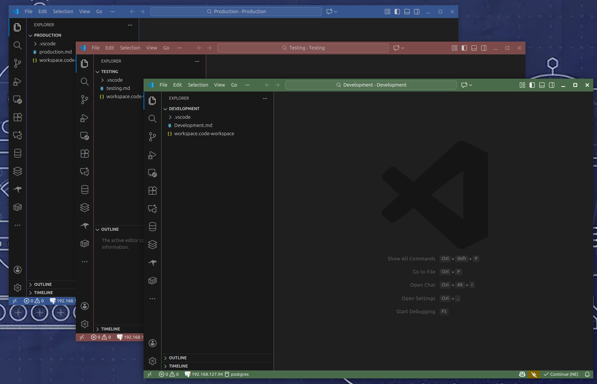
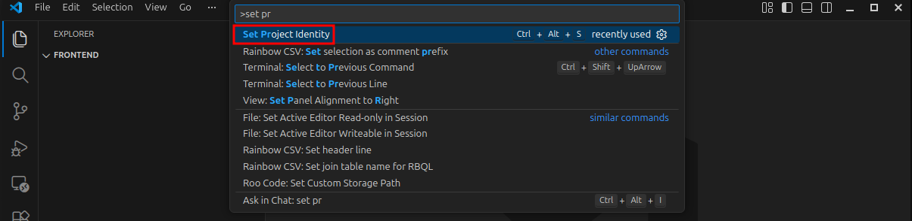
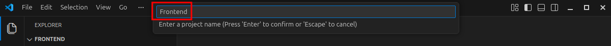
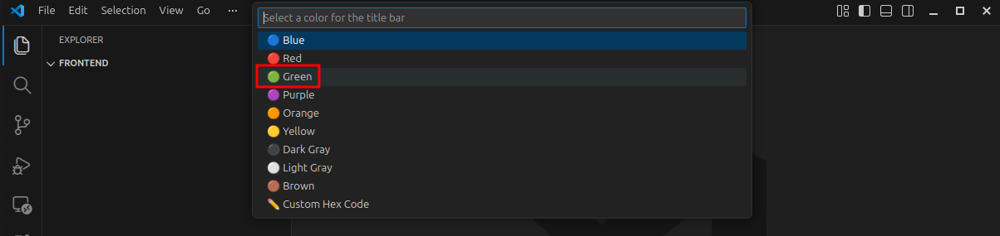
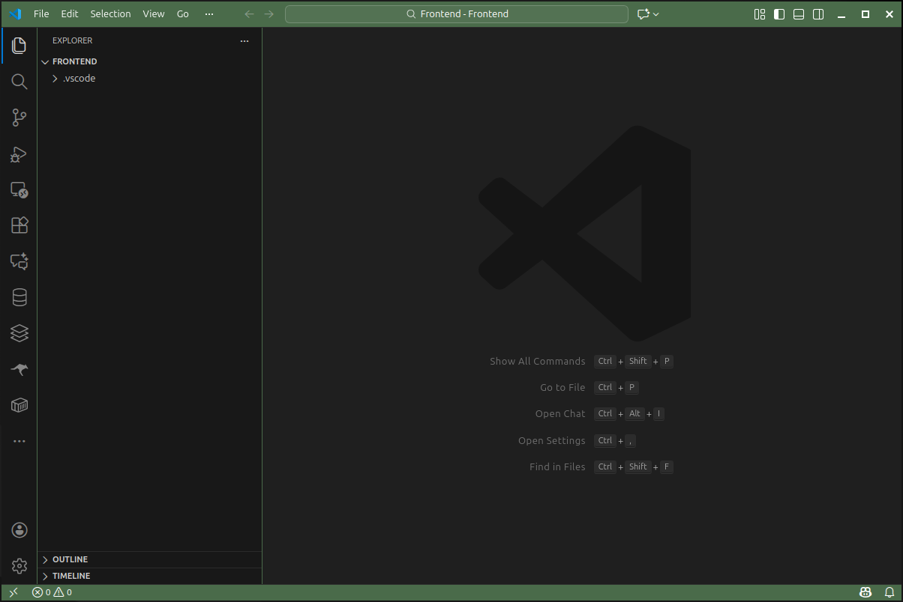

# Project Identity

A VS Code extension that helps you differentiate between multiple instances of the same repository by customizing the window title and title bar color for each workspace.

## Features

- **Custom Project Names**: Set a unique project name for each workspace instance
- **Color Customization**: Choose from 10 predefined colors or use custom hex codes to visually distinguish workspaces
- **Automatic UI Updates**: Instantly updates the title bar, status bar, activity bar, and sidebar with your custom colors
- **Settings Preservation**: Automatically backs up existing workspace settings before applying changes
- **Quick Access**: Use the keyboard shortcut `Ctrl+Alt+S` (or `Cmd+Alt+S` on macOS) to activate the extension

## Why Use Project Identity?

When working with multiple clones of the same repository (e.g., different feature branches, versions, or client-specific forks), it can be easy to get confused about which instance you're in. Project Identity makes it immediately clear which workspace you're currently viewing by:

- Updating the window title with your custom project name
- Applying a distinct color scheme to the title bar and status bar
- Making it visually obvious at a glance which repository instance is active

<video controls src="Images/Production-Test-Development.mp4" title="Title"></video>

## Usage

### Method 1: Command Palette
1. **Open a workspace folder** in VS Code
2. **Press `Ctrl+Shift+P`** (or `Cmd+Shift+P` on macOS) to open the command palette
3. **Type "Set Project Identity"** and press Enter

4. **Enter a project name** (e.g., "Frontend", "Backend", "AI-Feature")

5. **Select a color** from the predefined palette, or choose "Custom Hex Code" to enter your own

6. **VS Code will reload** and apply your custom settings

### Method 2: Keyboard Shortcut
1. **Open a workspace folder** in VS Code
2. **Press `Ctrl+Alt+S`** (or `Cmd+Alt+S` on macOS) to open the Project Identity command
3. **Enter a project name** (e.g., "Frontend", "Backend", "AI-Feature")
4. **Select a color** from the predefined palette, or choose "Custom Hex Code" to enter your own
5. **VS Code will reload** and apply your custom settings

## Available Colors

The extension includes 9 predefined colors:
- 🔵 Blue (`#36558f`)
- 🔴 Red (`#7d4a4a`)
- 🟢 Green (`#4a6b4a`)
- 🟣 Purple (`#553366`)
- 🟠 Orange (`#8b6f47`)
- 🟡 Yellow (`#8b8b3a`)
- ⚫ Dark Gray (`#3d3d3d`)
- ⚪ Light Gray (`#5a5a5a`)
- 🟤 Brown ('#6B4F3A')

Or enter any valid hex color code (e.g., `#2d5a87`) for complete customization.

## Customization

The extension modifies the following VS Code settings:
- `window.title`: Sets the window title with your project name
- `titleBar.activeBackground` and `titleBar.activeForeground`: Title bar colors
- `titleBar.inactiveBackground` and `titleBar.inactiveForeground`: Inactive title bar colors
- `statusBar.background` and `statusBar.foreground`: Status bar colors
- `activityBar.border` and `sideBar.border`: Border colors

All settings are stored in `.vscode/settings.json` in your workspace root. Existing settings are preserved and merged with the new Project Identity settings.

## Backups

The extension automatically backs up your existing `settings.json` before making any changes. Backups are saved with timestamps (e.g., `settings.json.backup.1702162800000`) in the `.vscode` directory, allowing you to restore previous configurations if needed.

## Keyboard Shortcuts

| Action | Windows/Linux | macOS |
|--------|---------------|-------|
| Set Project Identity | `Ctrl+Alt+S` | `Cmd+Alt+S` |

## Requirements

- VS Code 1.106.1 or higher

## Support

For issues, feature requests, or feedback, please visit the extension's repository or submit an issue on GitHub.

## License

See LICENSE.md for licensing information.

<a href="https://www.flaticon.com/free-icons/dropper" title="dropper icons">Dropper icons created by Freepik - Flaticon</a>

## Developer 

Extension created by Andrew Seaford 

<https://www.andrew-seaford.co.uk/>

<www.linkedin.com/in/andrewseaford>
